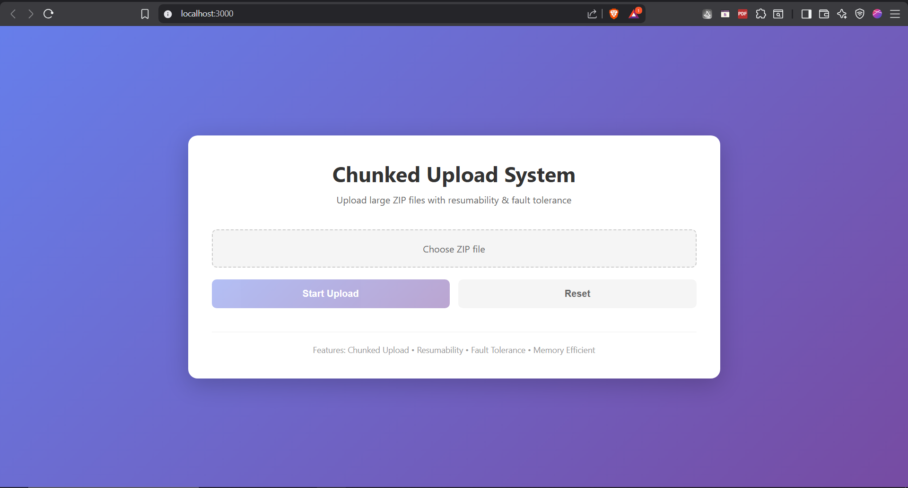
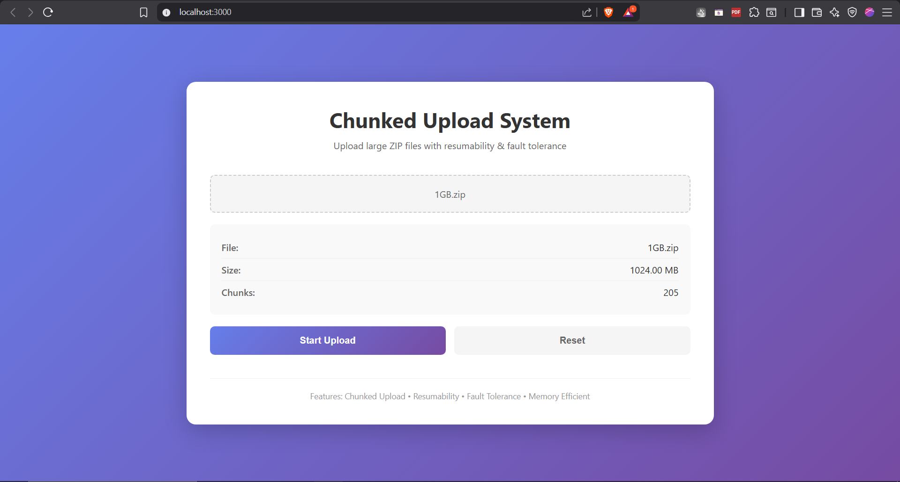
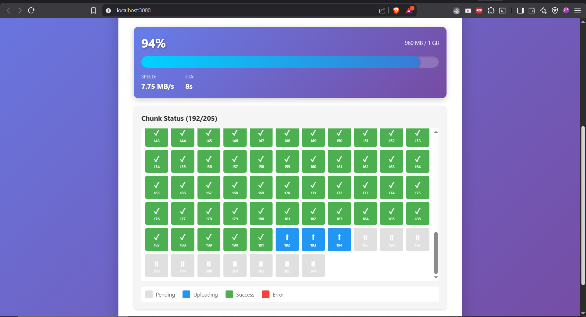
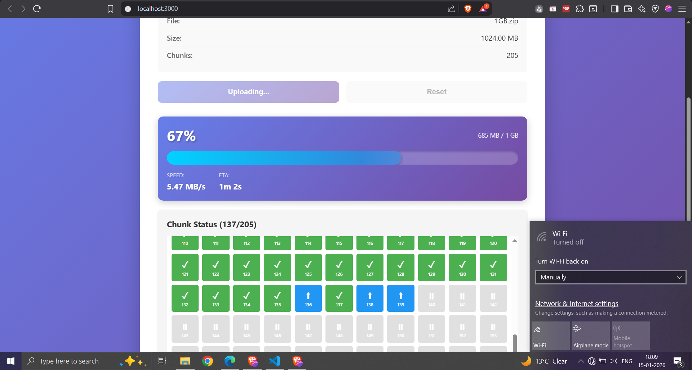
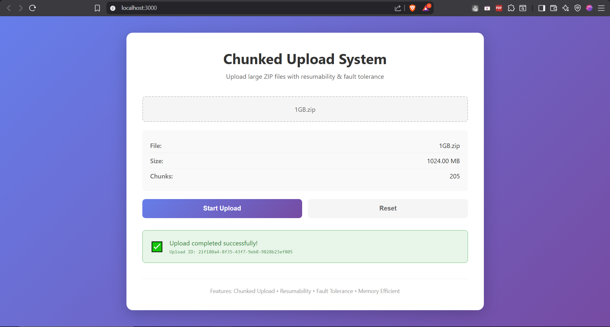

# Chunked Upload System

A system for uploading large ZIP files (>1GB) with resumability and fault tolerance. Built with Node.js/Express backend and React frontend.

## Features

- Large file support (>1GB) without memory issues
- Chunked upload with 5MB chunks
- Resume capability after interruption
- Automatic retry on failure
- Streaming I/O for memory efficiency
- Duplicate chunk handling
- Out-of-order chunk support
- ZIP file validation
- Automatic cleanup of abandoned uploads
- **Server crash recovery** - Resumes interrupted finalization on restart
- **Chunk-level hash validation** - SHA-256 verification before writing

## User Interface

- Real-time progress bar
- Visual chunk status grid
- Upload speed and ETA display
- Automatic resume on network failure

## Screenshots

### File Selection & Upload Initialization


### Upload Progress with Chunk Grid


### Active Upload with Real-time Stats



### Network Failure & Retry


### Upload Status & File Contents


## Tech Stack

- Frontend: React.js
- Backend: Node.js + Express
- Database: MySQL 8.0
- File Storage: Local filesystem
- Hashing: SHA-256
- ZIP Parsing: yauzl
- Containerization: Docker

## Architecture

### Upload Flow

1. Frontend: Select ZIP file
2. Frontend: Calculate SHA-256 hash
3. Frontend → Backend: POST /upload/init
   - Backend creates upload record in DB
   - Backend pre-allocates file on disk
   - Backend returns uploadId + already-uploaded chunks
4. Frontend: Slice file into 5MB chunks
5. Frontend: Skip already-uploaded chunks (for resumability)
6. Frontend → Backend: POST /upload/chunk (max 3 concurrent)
   - Frontend calculates chunk-level SHA-256 hash
   - Backend verifies chunk hash before writing
   - Backend streams chunk to correct file offset
   - Backend marks chunk as SUCCESS in DB
7. Backend: When all chunks received:
   - Calculate final SHA-256
   - Validate ZIP structure
   - Mark as COMPLETED
8. Frontend: Display success + uploadId

## Quick Start

### Prerequisites

- Docker & Docker Compose (or Node.js 18+ and MySQL 8.0)

### Using Docker

```bash
cd Assignment-Project
docker-compose up -d
```

Access:
- Frontend: http://localhost:3000
- Backend API: http://localhost:3001

### Local Development

Backend:
```bash
cd backend
npm install
cp .env.example .env
npm run init-db
npm run dev
```

Frontend:
```bash
cd frontend
npm install
npm start
```

## API Endpoints

### POST /upload/init
Initialize new upload session.

Request:
```json
{
  "filename": "large_file.zip",
  "totalSize": 1073741824,
  "totalChunks": 205
}
```

Response:
```json
{
  "uploadId": "550e8400-e29b-41d4-a716-446655440000",
  "uploadedChunks": [0, 1, 5],
  "message": "Upload initialized successfully"
}
```

### POST /upload/chunk
Upload individual chunk (multipart/form-data).

Parameters:
- uploadId: string
- chunkIndex: number
- chunk: binary file data

### GET /upload/:id/status
Get upload status and progress.

### GET /upload/:id/contents
List ZIP file contents without extraction.

## Database Schema

```sql
CREATE TABLE uploads (
    id VARCHAR(36) PRIMARY KEY,
    filename VARCHAR(255) NOT NULL,
    total_size BIGINT UNSIGNED NOT NULL,
    total_chunks INT UNSIGNED NOT NULL,
    status ENUM('UPLOADING', 'PROCESSING', 'COMPLETED', 'FAILED'),
    file_path VARCHAR(512) NOT NULL,
    final_hash VARCHAR(64),
    created_at TIMESTAMP DEFAULT CURRENT_TIMESTAMP,
    completed_at TIMESTAMP NULL
);

CREATE TABLE chunks (
    upload_id VARCHAR(36) NOT NULL,
    chunk_index INT UNSIGNED NOT NULL,
    status ENUM('PENDING', 'SUCCESS') DEFAULT 'PENDING',
    received_at TIMESTAMP NULL,
    PRIMARY KEY (upload_id, chunk_index),
    FOREIGN KEY (upload_id) REFERENCES uploads(id) ON DELETE CASCADE
);
```

## File Integrity & Security

### Hashing Strategy
1. **Client-Side Pre-Upload Hash**: Frontend calculates SHA-256 of entire file before upload using streaming API (64KB buffer chunks)
   - Identifies duplicate uploads
   - Enables resume detection
   
2. **Chunk-Level Hash Validation**: Each chunk validated before writing to disk
   - Frontend calculates SHA-256 hash per chunk (5MB)
   - Backend verifies hash before accepting chunk
   - Prevents corrupted chunks from being written
   - Immediate failure detection and retry

3. **Server-Side Post-Assembly Hash**: Backend calculates SHA-256 after all chunks are merged
   - Validates file integrity
   - Detects corruption during transmission
   - Stored in database as `final_hash`

4. **Transaction-Level Validation**: Each chunk is validated through:
   - Database transaction tracking
   - Idempotent handling (duplicate chunks rejected)
   - Offset-based writing prevents overwrites

### ZIP Validation
- Uses `yauzl` streaming library to peek inside ZIP without full extraction
- Validates ZIP structure without loading into memory
- Lists top-level filenames for verification

## Pause/Resume Logic

### How It Works
1. **Initialization Handshake**: Frontend calls `/upload/init` with file metadata
   - Backend queries database for existing upload with same file hash/name/size
   - Returns `uploadedChunks` array with already-completed chunk indices

2. **Resume from Partial State**: 
   - Frontend skips already-uploaded chunks
   - Only uploads missing chunks
   - Works across page refreshes, browser restarts, or network failures

3. **State Persistence**:
   - Database tracks each chunk's status (`PENDING` or `SUCCESS`)
   - File pre-allocated on disk with correct size
   - Chunks written to specific offsets (order-independent)

4. **Network Failure Recovery**:
   - Automatic retry with exponential backoff (500ms, 1s, 2s)
   - Frontend maintains chunk queue
   - Failed chunks re-added to queue automatically

## Server Crash Recovery

The system automatically recovers from server crashes and restarts:

### On Server Startup
1. **Recovery Service Runs Automatically**:
   - Scans database for uploads stuck in `PROCESSING` state
   - These are uploads where finalization was interrupted

2. **Interrupted Upload Recovery**:
   - Verifies all chunks are received
   - If incomplete: Resets status to `UPLOADING` (client can resume)
   - If complete: Resumes finalization process

3. **Finalization Resume**:
   - Validates file size matches expected size
   - Calculates SHA-256 hash of assembled file
   - Verifies ZIP structure
   - Updates status to `COMPLETED` or `FAILED`

4. **Abandoned Upload Cleanup**:
   - Identifies uploads stuck in `UPLOADING` for >24 hours
   - Marks as `FAILED` and deletes partial files
   - Prevents disk space waste

### Implementation
- **Database Locking**: Uses `FOR UPDATE` to prevent double-finalization
- **Idempotent Operations**: Safe to run recovery multiple times
- **Graceful Degradation**: Failed recoveries logged but don't crash server

## Known Trade-offs

1. **Disk Space**: Pre-allocates full file size upfront
   - **Pro**: Prevents partial writes, enables offset-based chunks
   - **Con**: Requires available disk space before upload starts

2. **Database Load**: Every chunk creates a database transaction
   - **Pro**: Strong consistency, perfect resumability
   - **Con**: High DB write load for large files (1GB = ~200 transactions)

3. **Concurrency Limit**: Fixed at 3 concurrent uploads
   - **Pro**: Prevents browser/server overload
   - **Con**: May be slow on high-bandwidth connections

4. **In-Memory Hash Calculation**: Client-side hashing uses streaming but still CPU-intensive
   - **Pro**: Accurate file fingerprint
   - **Con**: Delays upload start for large files

5. **No Content Deduplication**: Same file uploaded twice creates two records
   - **Pro**: Simple implementation
   - **Con**: Wastes storage

6. **Chunk Hash Computation**: Each chunk hashed before upload adds CPU overhead
   - **Pro**: Detects corruption immediately, prevents bad chunk writes
   - **Con**: ~5-10ms delay per 5MB chunk on average hardware

## Bonus Cases Implementation

### 1. The "Double-Finalize"
**Solution**: Database row locking with `FOR UPDATE` in finalization logic
- First finalization attempt locks the upload row
- Status immediately updated to `PROCESSING`
- Concurrent attempts see non-`UPLOADING` status and abort
- Prevents race conditions and duplicate processing

### 2. Network Flapping (30% Failure Rate)
**Solution**: Configurable failure simulation + retry logic
- Backend: `SIMULATE_FAILURE_RATE` environment variable
- Frontend: Exponential backoff retry (500ms → 1s → 2s)
- Maximum 3 retry attempts per chunk
- Failed chunks automatically re-queued

### 3. Out-of-Order Delivery
**Solution**: Offset-based file writing
- Pre-allocated file with full size on disk
- Each chunk written to: `offset = chunkIndex × CHUNK_SIZE`
- Chunks can arrive in any order
- File assembled correctly regardless of sequence

### 4. Server Crash Recovery
**Solution**: Automatic recovery service on startup
- Detects uploads stuck in `PROCESSING` state
- Resumes finalization if all chunks present
- Resets to `UPLOADING` if chunks missing
- Cleans up abandoned uploads (>24 hours old)
- Database survives crash, recovery is automatic

## Further Enhancements

### Performance
- **Parallel Chunk Upload Tuning**: Make concurrency configurable based on network speed
- **Adaptive Chunk Size**: Increase chunk size for high-bandwidth connections
- **CDN Integration**: Upload chunks to S3/CloudFront for distributed storage
- **WebSocket Progress**: Replace HTTP polling with WebSocket for real-time updates

### Reliability
- **Database Replication**: Add read replicas for status queries
- **Graceful Degradation**: Continue uploads even if metrics fail
- **Job Queue System**: Add Redis/RabbitMQ for finalization queue persistence

### Features
- **Multi-File Upload**: Queue system for uploading multiple files
- **Background Upload**: Service Worker for uploads that survive tab closure
- **Compression**: Optional gzip compression for chunks before transmission
- **Encryption**: Client-side encryption before upload (E2EE)
- **Upload History**: UI to view/resume past uploads
- **Admin Dashboard**: Monitor active uploads, storage usage, cleanup logs

### Security
- **Authentication**: Add JWT/OAuth for user-based uploads
- **File Type Validation**: Deep inspection beyond extension check
- **Rate Limiting**: Prevent abuse with per-IP/user limits
- **Virus Scanning**: Integrate ClamAV for uploaded files
- **CORS Configuration**: Restrict API access to trusted domains

### Scalability
- **Horizontal Scaling**: Stateless backend with shared storage (NFS/S3)
- **Job Queue**: Use Redis/RabbitMQ for finalization tasks
- **Microservices**: Separate upload, finalization, and cleanup services
- **Load Balancer**: Distribute chunk uploads across multiple backend instances

## License

MIT
